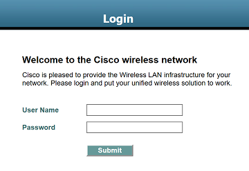
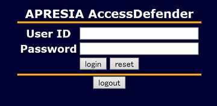

# LAN Agent
A set of tools to log in to LAN controllers automatically, for Windows.  
LAN に自動的にログインするためのツールのセットです。Windows 向けです。

These tools support the following LAN controllers:
- Cisco Wireless LAN Controller (WLC)
- APRESIA AccessDefender

## LAN Agent Console
A command line tool to log in to LAN controllers automatically.  
LAN に自動的にログインするためのコマンドライン ツールです。

### Setup
- [Download the app](https://github.com/kcg-edu-future-lab/LAN-Agent/raw/master/Downloads/LanAgentConsole-1.0.1.zip)

### Usage
- Edit `Username` and `Password` on LanAgentConsole.exe.config
- Execute LanAgentConsole.exe

### System Requirements
- .NET Framework 4.5

### Release Notes
- **v1.0.1** The first release.

## WLC Agent Console
A command line tool to log in to the Cisco Wireless LAN Controller (WLC) automatically.  
Cisco Wireless LAN Controller (WLC) に自動的にログインするためのコマンドライン ツールです。

### Setup
- [Download the app](https://github.com/kcg-edu-future-lab/LAN-Agent/raw/master/Downloads/WlcAgentConsole-1.0.1.zip)

### Usage
- Edit `Username` and `Password` on WlcAgentConsole.exe.config
- Execute WlcAgentConsole.exe

### System Requirements
- .NET Framework 4.5

### Release Notes
- **v1.0.1** The first release.

## Future Plans
- Creates an icon in the notification area to ensure the network periodically.  
定期的にネットワークを確認するための通知領域アイコンを作成します。
- For macOS.  
macOS 版。
